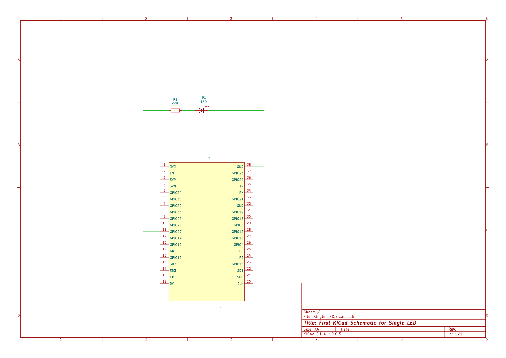

# ESP-32 Blinking LED Project

Simple first Test project with ESP32 Development Board for a blinking single LED


## Setup

* **IDE:** [VS Code](https://visualstudio.com) with extension **PlatformIO IDE**.
* **Framework:** Arduino
* **Hardware:** ESP32 Development Board (NodeMCU ESP32) + 1 LED

## Schematic 
1. GPIO Pin (Anode,+) on ESP32 connected to a resistor (220 Ohm)
2. Resistor connected to Anode (+) of the LED
3. Cathode (-) of the LED connected to GND on ESP32

git
## Code (`src/main.cpp`)

```cpp
#include <Arduino.h>
// Select an usable GPIO from ESP32 (e.g. GPIO 27, cathode(+:HIGH))
const int ledPin = 27;

// Set selected GPIO as OUTPUT
void setup() {
  pinMode(ledPin, OUTPUT);
}

// loop for the blinking LED
void loop() {
  digitalWrite(ledPin, HIGH);
  delay(1000);
  digitalWrite(ledPin, LOW);
  delay(1000);
}
```

## PlatformIO configuration (`platformio.ini`)

```ini
[env:esp32dev]
platform = espressif32
board = esp32dev
framework = arduino
monitor_speed = 115200
```


## Execute
1. Connect ESP32 with USB to your computer.
2. Click in the status bar in VS code (PlatformIO Symbols) on the checkmark to build the code.
3. Click on the arrow (Upload) to transform the code on the ESP32